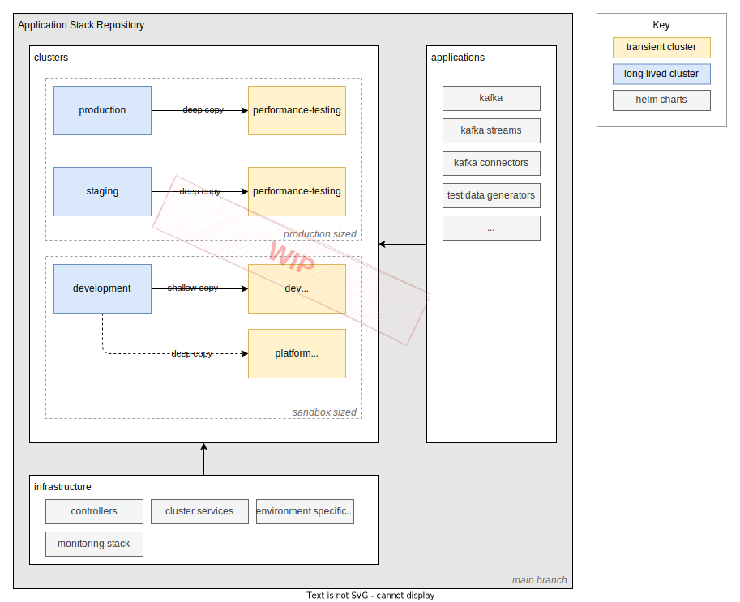
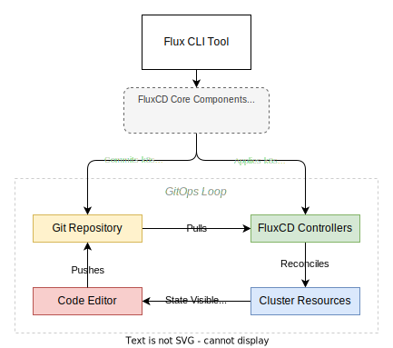
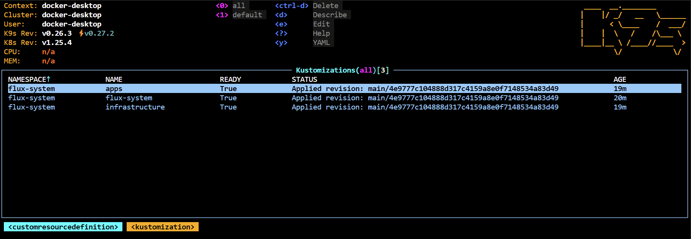
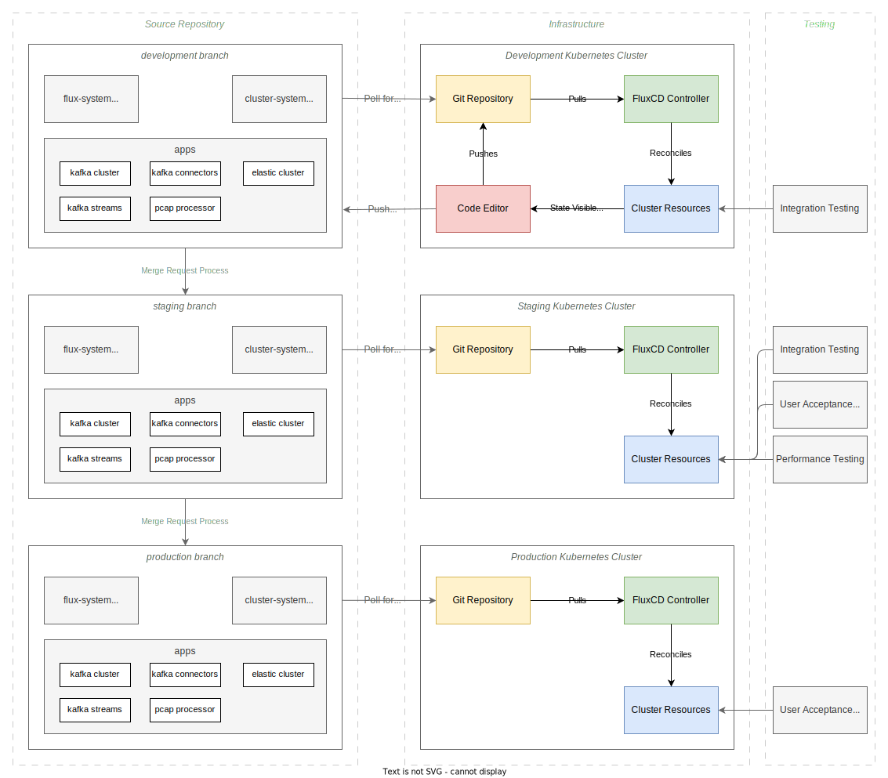

# Kubernetes - Software & Platform Development Lifecycle


_This repository exists to explore, experiment with and report on findings with using FluxCD and a pull based GitOps workflow to enable a software development lifecycle oriented around containers and long lived kubernetes clusters and all the pitfalls found._

## What is a GitOps workflow?

We might as well start with the direction of travel here; why a GitOps workflow at all? Why pull rather than push?

GitOps at its core is the concept of representing operational state in a git repository, trying to incorporate the software development lifecycle methods used by software engineering but dropping the bits that make no sense in a declarative environment.

In addition to this you have two methodologies for utilising git sources of truth for deployments; a push workflow where in changes are made to a repository and these changes are _pushed_ to resulting clusters to enforce state changes, and a pull workflow where in these changes are stored in the repository but the responsibility on reading these changes and reconciling the state of the cluster to match the state of the repository is in the hands of the controllers in the cluster.

Since Nominet already operates the former this experimental hands on repository is aiming to try and solve the pull based workflow.

### FluxCD - GitOps Pull deployments

There's two leading technology stacks in the Kubernetes space at the time of writing (early 2023) that aim to solve the problem of pull based gitops deployment flows; ArgoCD and FluxCD.

ArgoCD is the market leader as it currently stands but it suffers some shortcomings making it a little less suited to the task in hand:

* ArgoCD is a monolithic controller that's relatively heavy weight by any standard. All the features are deployed in one go.
* It ships with a WebUI by default to attempt to make the whole process easier, though it detracts from the YAML driven source of truth model.
* It is more suited as a glorified Helm frontend, think iOS app store for Kubernetes. 

FluxCD v2 is a modular continuous deployment product with modularity, and an emphasis of YAML driven deployments.

* FluxCD can just deploy the bare minimum to get going; a source controller and helm controller.
* It has an optional Web UI that is maturing quickly ([WeaveWorks GitOps](https://github.com/weaveworks/weave-gitops))
* Can be used to represent the full state of a cluster as it bootstraps itself to connect to itself at install time.

So with FluxCD v2 selected for the experiment, here's a high level view of how FluxCD works.


The feedback loop described by the diagram above works as follows:

1. You make a change to a YAML file(s) and commit your changes and push them to a git repository.
2. The fluxCD controller periodically pulls the repository from git, and looks for changes.
3. Any changes detected get reconciled with any sub object in the cluster that the root controller controls.
4. These reconciled states are now visible to the developer in their local IDE or kubernetes resource viewer _(k9s, lens etc)_.

The rationale for adopting this workflow can be broadly split up into the following goals:

* **Repeatability** - if you want multiple clusters to be in state sync they can all subscribe for changes from the same cluster template.
* **Promotion of changes** - each cluster has a state, enshrined in git; if you want to promote a change it's a case of copying a file from one directory to another and committing the changes.
* **Audit of changes** - since you're using merge requests there's an audit log in the git repository of changes made, when and by whom.
* **Disaster recovery** - since your state is in code, failing over or rebuilding any environment (sans data - backup and restore of persistent data is another topic all together) is easy.

## Git Repository Structure

There is no prescribed way to lay out a GitOps workflow for kubernetes; this is partially because every business has their own physical topology and the directory topology should represent this rather than be opposed to it. Additionally the concept of directories in the state has no bearing on the cluster state, any directory layout is purely to aid the human cognitive load - you can (and _shouldn't_) represent an entire kubernetes cluster in a single monolithic YAML document.

With that in mind I've attempted to draw up a topology in this repository that represents a balance between flexibility and declarative rigidity.

_Don't Repeat Yourself_ (DRY) is a contentious subject in any system that represents state declaratively, be it Terraform or Kubernetes manifests. As such there is going to be a mix of duplication and inheritance in this project. This represents an attempt to strike a balance, but this is only confirmed retroactively when you try to iron out pain points where in too much inheritance ties your hands on changes having too large of a blast radius, and too much duplication adding to the cognitive load and maintenance costs of running many environments.

So as a first public draft the following diagram attempts to find those balances, but first - a set of assumptions is being made:

1. There is **a reason** to have templates to represent a _type_ of cluster; allows for bespoke scaling, high availability and other _cost_ incurring differences.
1. There is **a reason** to run multiple clusters that inherit from that _type_ of cluster; it is likely you'll want more than any given template running.
1. There is **a reason** to run _ephemeral_ clusters that can inherit from any _type_ of cluster; for cost savings and transient use cases.
1. There is **a reason** to have different application configurations in different environments; permits testing a single component in isolation with mocked services.
1. There is **not a reason** to run different configurations of infrastructure on each cluster; there should be a baseline assumption all clusters will have the same underlying core resources available in every environment for operational overhead reductions.

The following diagram is an example kafka cluster with the various auxiliary components you may wish to run in such a stack, from the perspective of the `main` branch.

> **NOTE**: _The complexity around making changes and testing them before impacting a group of users is addressed later on in this document._



## Deployment

While not strictly related to this repository it's worth having a reference implementation and since most of you reading this will likely have Docker Desktop installed, the write-up will use it as a reference implementation - though if you know what you're doing it should work equally well on Kind, K3d and Rancher Desktop.

Here is a list of documented environments and how to set up a cluster:

* [Docker Desktop](create/docker-desktop/README.md)
* [EKS](create/eks/README.md)
* [k0s](create/k0s/README.md)
* [k3d](create/k3d/README.md)
* [k3s](create/k3s/README.md)
* [Kind](create/kind/README.md)
* [minikube](create/minikube/README.md)
* [rancher-desktop](create/rancher-desktop/README.md)

### Bootstrapping

As you may have noticed, a closed loop needs to start somewhere! Having the git repository representing the state, and a cluster listening to that state from a raw state is called bootstrapping.

Bootstrapping is used to create the repository if necessary, but if it already exists, will create the `flux-system` kubernetes manifests to get going and commit them to the branch.



Flux provides a CLI tool to do this, as it has to deploy a `GitRepository` object for the source controller to go clone from, as well as the config for the `GitRepository` object, in git. Failure to do this would mean the first time the source controller ran a reconciliation run, it'd detach itself from the repository as the `GitRepository` object containing a upstream reference to itself, would be missing - and thus deleted.

This can be seen in [`gotk-sync.yaml`](clusters/development/flux-system/gotk-sync.yaml), where in the core objects are defined, and link the cluster back to themselves.

To get around this bootstrap paradox the CLI does this all simultaneously - both creating the objects that store the remote urls and config/secrets to pull from them, as well storing the resulting objects it pushes to the cluster in the source try and pushes them before the first reconciliation run starts.

#### Example

To create a new cluster template, for example `clusters/abc` with a different combination of services from the components in this repository, you need to use the `flux bootstrap` command.

This also requires a personal access token from Gitlab so that it can insure the repository exists (it'll create it if it doesn't), and if it does can write commits into the tree into the `clusters/` directory. Remember to set the branch you wish to push this new cluster template into.

```bash
export GITLAB_TOKEN= # put your personal access token here with api, read_api and read_repository access
flux bootstrap gitlab --context=docker-desktop --owner=***REMOVED*** --repository=gitops-pull-experiment --branch=main --path=./clusters/abc
```

### Development Deployments

To deploy an existing cluster template you need to add a `GitRepository` object that contains a reference to the upstream source, and an initial bootstrapping Kustomization object, which is the parent object for child Kustomizations, HelmCharts and other kubernetes objects.


1. Add the FluxCD controllers to the cluster:
    > **NOTE**: _If you do not specify a cluster context, it'll use the default - but it's best to be explicit. Using `docker-desktop` as the example._

    ```shell
    flux install --context=docker-desktop
    ```

1. Adding a git repository to the FluxCD controller:
    > **NOTE**: _This command will echo an SSH public key string to the terminal, it needs to be added to the repository [deploy keys](https://gitlab.com/***REMOVED***/fluxcd-testbed/-/settings/repository#js-deploy-keys-settings)._

    ```shell
    flux create source git flux-system --context=docker-desktop --url=ssh://git@gitlab.com/***REMOVED***/fluxcd-testbed.git --branch main
    ```

1. Bootstrapping this cluster against a predefined template:

   ```shell
   flux create kustomization flux-system --context=docker-desktop --source="GitRepository/flux-system" --path="./clusters/local" --prune=true --interval=1m 
   ```

1. Check k9s/lens/kubectl for success:

   

For documentation how cluster templates, components and sub components work, follow the README.md chains down the directories. 
For example, start in `./clusters/local/README.md` and follow the links from there.

## Change Promotion

Change promotion is a difficult concept to tackle; you want to retain enough flexibility to play with potential changes you wish - with the caveat there needs to be a clear path to getting it to production should the change be beneficial.

